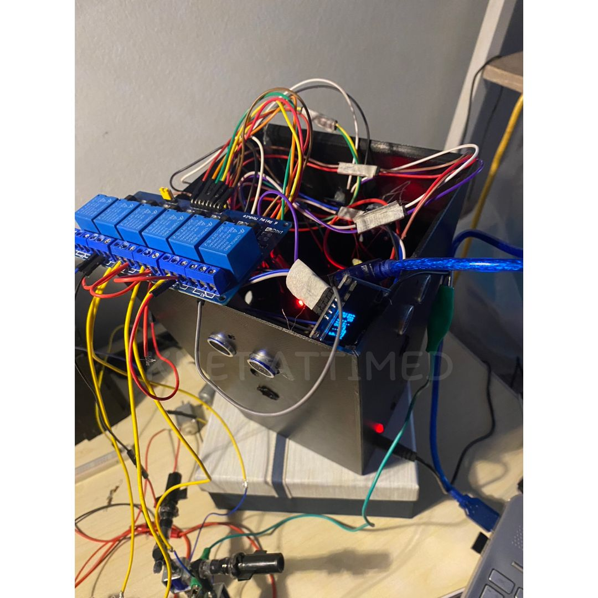
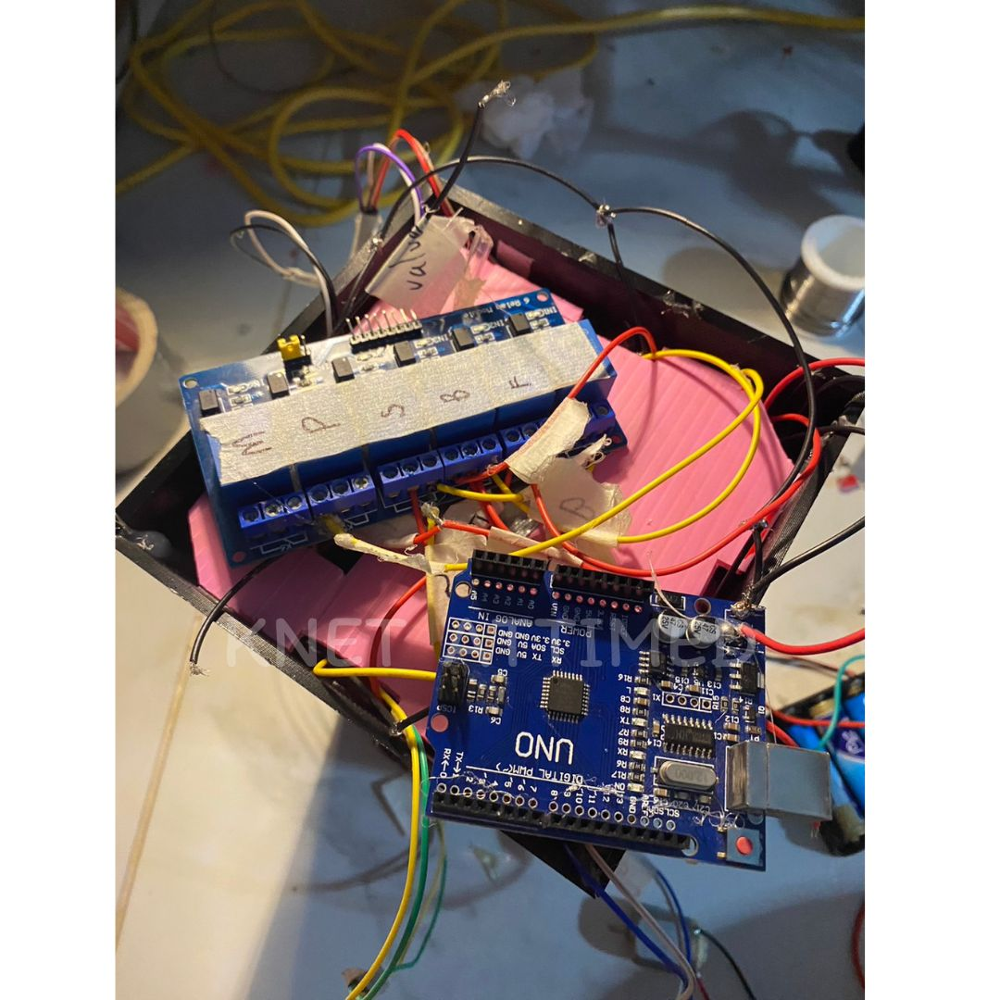
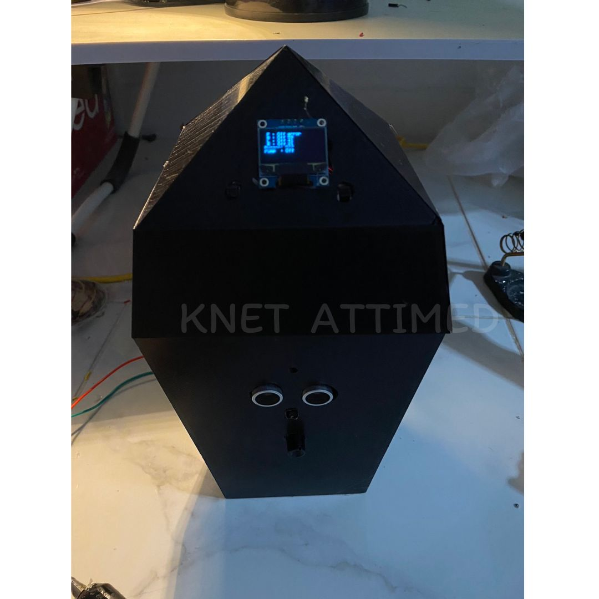
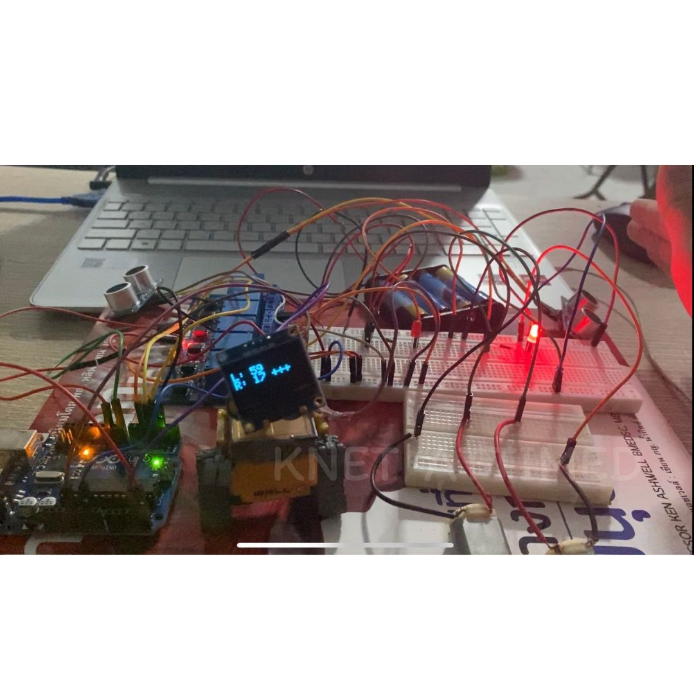
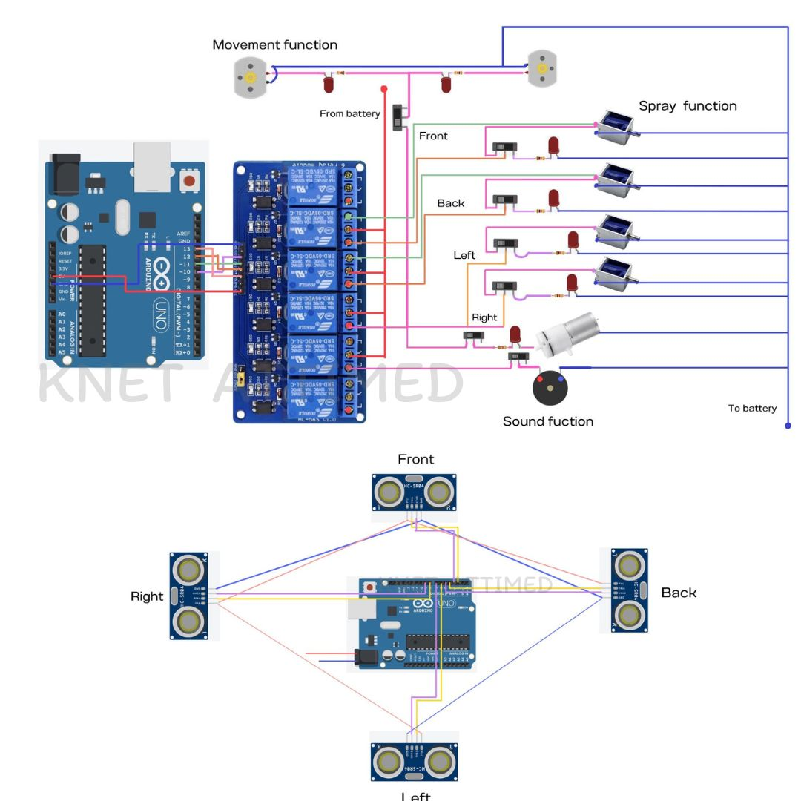
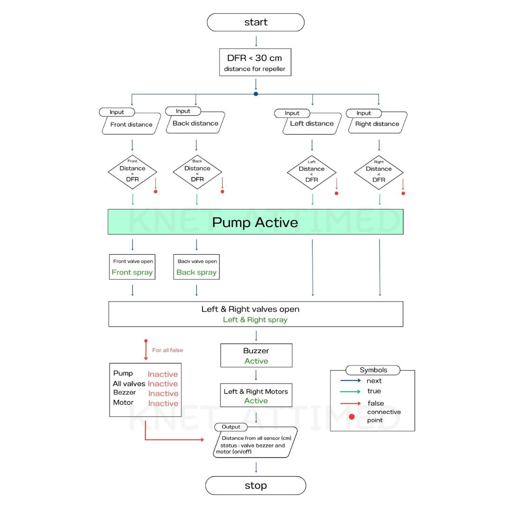

# Bird Repeller Model 🦅⚠️
"Bird Repeller Model" is the final project of senior high school. This model consists of various electronic components, all controlled by an Arduino board. I will publish the code that I have written and the functions of this model.
- acid spray
- buzzer (sound)
- motor (movement)

This model is equipped with ultrasonic sensors in all four directions, measuring the distance of approaching objects by converting results into travel time of ultrasonic waves using the formula: soundSpeed = 331.5 + 0.6 * (temperature). If an object enters the detection range, the valve opens, and acid spray is released in the obstructed direction, operating based on the principle of control valves. Additionally, it can emit sound through a buzzer and includes a side motor to rotate a tube (or other installed device) to enhance movement. All functions are displayed on an OLED screen located at the front of the device. Finally, the entire system can be controlled using an on/off switch.


## Images of the project ⭐
|  |  |  |
|-------------------------|-------------------------|-------------------------|
|  |  |  |

### Info:

```
  The project : Bird Repeller Model
  Program “Repeller model 1.1 x"
  coding by Knet Attimed (Kiattisak Phothawimoncharat)
  used for learning only please reference me
  https://github.com/KnetAttimed
```
